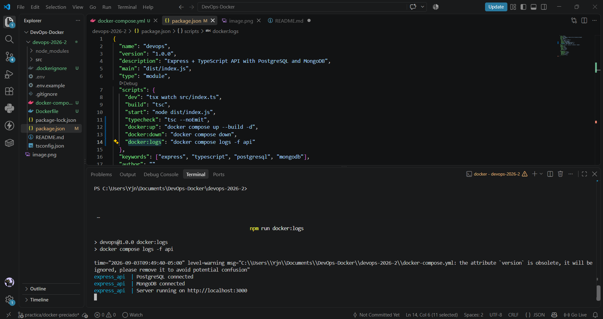
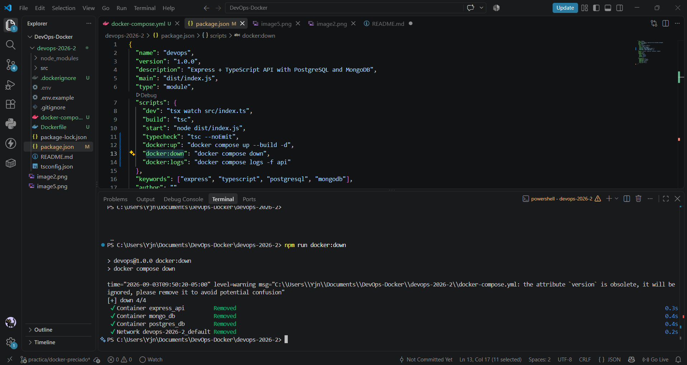

# Express + TypeScript API (PostgreSQL + MongoDB)

API en Node.js con Express y TypeScript que expone endpoints contra PostgreSQL y MongoDB.

## Requisitos

- Node.js 18+
- PostgreSQL en ejecución
- MongoDB en ejecución

## Configuración

1. Copia el archivo de entorno:

```bash
cp .env.example .env
```

2. Ajusta credenciales en `.env` si hace falta.

## Instalación y arranque

```bash
npm install
npm run dev
```

Build de producción:

```bash
npm run build
npm start
```

## Endpoints

| Método | Ruta | Descripción |
|--------|------|-------------|
| GET | `/health` | Health del API |
| GET | `/api/postgres/health` | Health de PostgreSQL |
| GET | `/api/postgres/users` | Lista usuarios (Postgres) |
| POST | `/api/postgres/users` | Crea usuario (Postgres) |
| GET | `/api/mongo/health` | Health de MongoDB |
| GET | `/api/mongo/users` | Lista usuarios (Mongo) |
| POST | `/api/mongo/users` | Crea usuario (Mongo) |

### Ejemplos

```bash
curl http://localhost:3000/health

curl http://localhost:3000/api/postgres/health
curl -X POST http://localhost:3000/api/postgres/users ^
  -H "Content-Type: application/json" ^
  -d "{\"name\":\"Ana\",\"email\":\"ana@example.com\"}"

curl http://localhost:3000/api/mongo/health
curl -X POST http://localhost:3000/api/mongo/users ^
  -H "Content-Type: application/json" ^
  -d "{\"name\":\"Luis\",\"email\":\"luis@example.com\"}"
```

Body esperado en POST `/users`:

```json
{
  "name": "Nombre",
  "email": "correo@example.com"
}
```
## Evidencias de Ejecución

### 1. Estado de los contenedores


### 2. Pruebas de Salud y Endpoints


### 3. Logs y apagado del Stack


