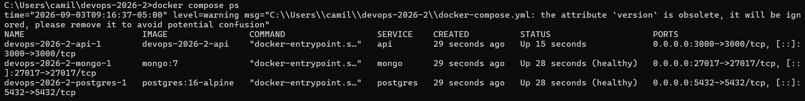
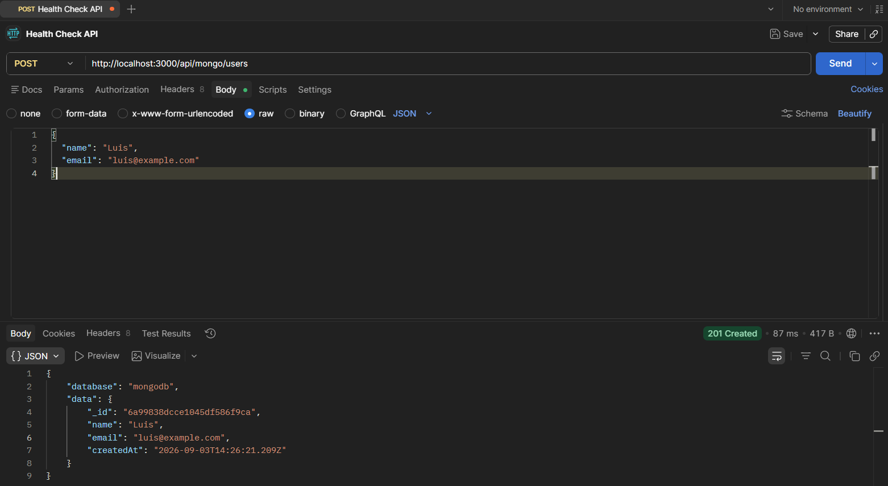
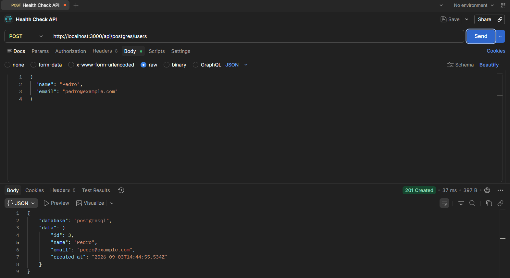
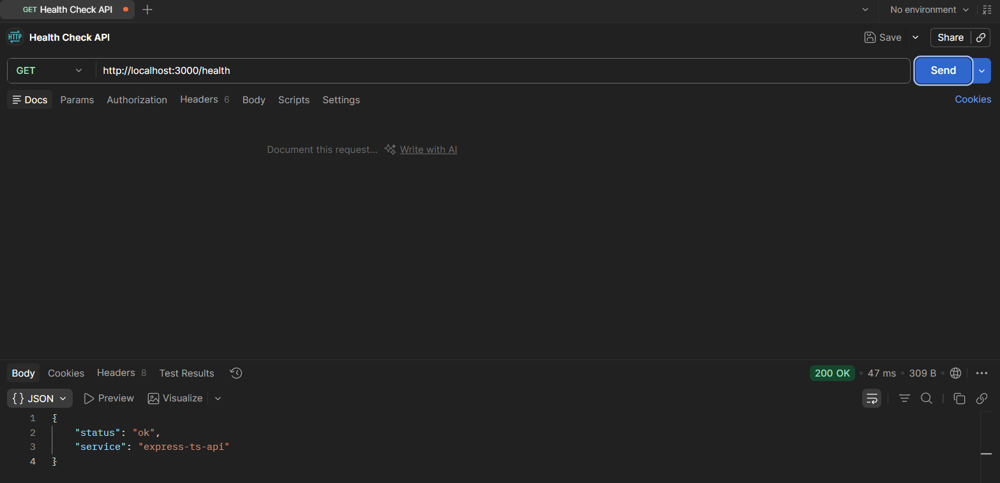
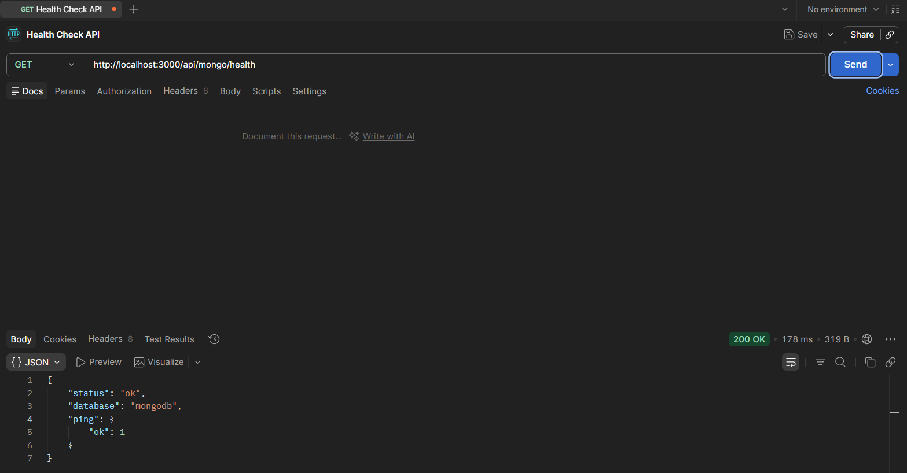

# API Express + TypeScript con Docker

## 🚀 Descripción

API REST en Node.js/Express con TypeScript, conectada a PostgreSQL y MongoDB.  
Ahora dockerizada para correr en cualquier máquina con un entorno consistente.

---

## 📋 Requisitos

- Node.js 18+ (solo para desarrollo local)
- Docker Desktop instalado y corriendo
- Git

---

## ⚙️ Instalación y arranque

### Clonar el repositorio

```bash
git clone https://github.com/uni-dev-labs/devops-2026-2.git
cd devops-2026-2
git checkout -b practica/docker-tu-apellido
```

## Copiar variables de entorno

- copy .env.example .env # En PowerShell

## Instalar dependencias

- npm install
- npm run typecheck

## Construir y levantar el stack:

- bash
- docker compose up --build -d
- Verificar servicios:

- bash
- docker compose ps
- docker compose logs -f api

## Detener contenedores:

- bash
- docker compose down

## Puertos expuestos

- API → http://localhost:3000

- PostgreSQL → localhost:5432

- MongoDB → localhost:27017

## 🔗 Endpoints

- GET /health → estado general de la API

- GET /api/postgres/health → conexión con PostgreSQL

- GET /api/mongo/health → conexión con MongoDB

- POST /api/postgres/users → crear usuario en Postgres

- POST /api/mongo/users → crear usuario en Mongo

# Eejemplo del POST

{
"name": "Ana",
"email": "ana@example.com"
}

## 📸 Evidencia

# Docker Compose



# Logs de la API

- Mongo:
  

- PostgreSQL:
  

# Pruebas en POSTMAN

- API:
  

- PosgreSQL:
  

- Mongo:
  

## ✅ Checklist de aceptación

docker compose up --build -d levanta api, postgres y mongo sin errores.

Endpoints /health, /api/postgres/health, /api/mongo/health responden OK.

Inserción de usuarios funciona en ambas bases.

Existen Dockerfile, .dockerignore, docker-compose.yml y README actualizado.

La API usa nombres de servicio Docker (no localhost) para conectar a las bases.
